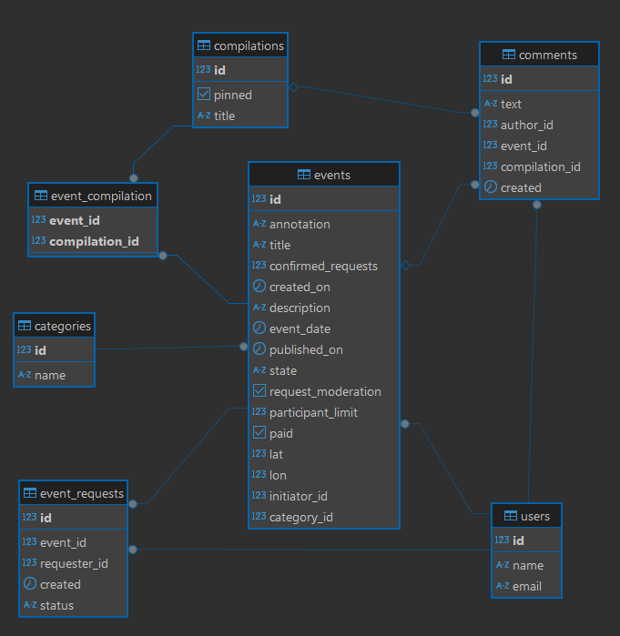

# java-explore-with-me

Database ewm-service:

Database stats:

Добавлена новая функциональность comments. Благодаря ей пользователи могут добавлять комментарии к мероприятиям или
к подборкам. Добавить комментарий можно только к опубликованному событию, а изменить или удалить комментарий может
только его владелец. Теперь при получении определенного мероприятия или подборки будет выводиться список комментариев.